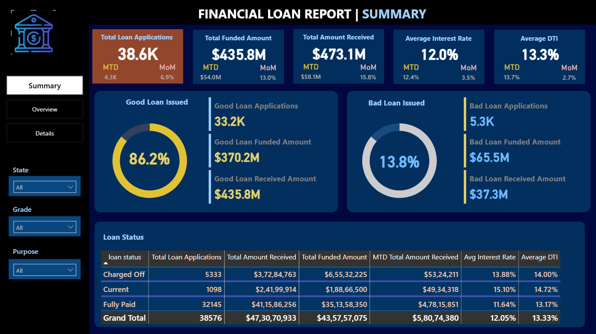
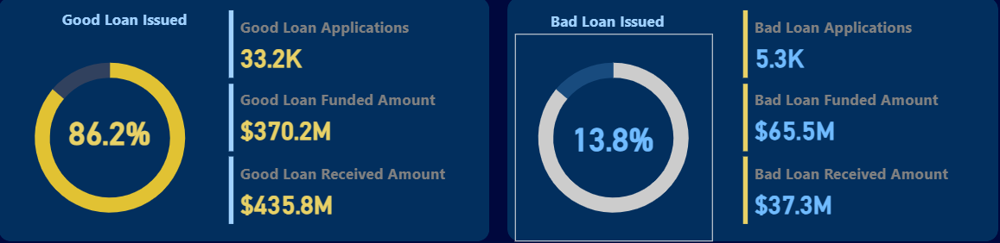
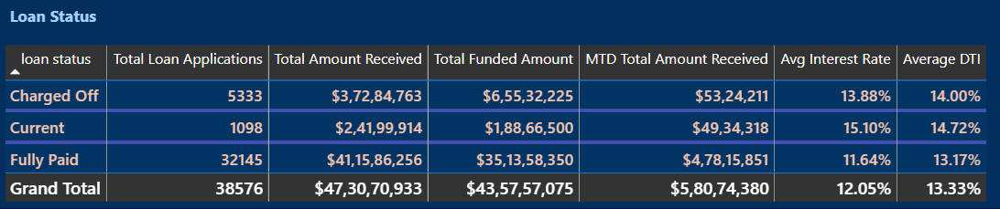

# 🏦 Bank Loan Risk Analysis Dashboard

> **End-to-End Data Analytics Project using SQL, Python, and Power BI**

## 📖 Project Overview

This project analyzes bank loan data to evaluate loan performance, monitor lending activities, and identify credit risk using **SQL**, **Python**, and **Power BI**.

The analysis focuses on key lending KPIs, Good Loan vs Bad Loan performance, and loan status trends to help financial institutions make informed, data-driven decisions.

---

## 🎯 Business Objectives

* Analyze overall loan application trends.
* Measure loan funding and repayment performance.
* Compare Good Loans and Bad Loans.
* Evaluate loan portfolio health.
* Monitor loan status across different categories.
* Build interactive dashboards for business decision-making.

---

## 🛠️ Tech Stack

| Tool       | Purpose                                   |
| ---------- | ----------------------------------------- |
| SQL        | Data Extraction & Analysis                |
| Python     | Data Cleaning & Exploratory Data Analysis |
| Pandas     | Data Manipulation                         |
| NumPy      | Numerical Operations                      |
| Matplotlib | Data Visualization                        |
| Seaborn    | Statistical Visualization                 |
| Power BI   | Interactive Dashboard Development         |

---

## 📂 Repository Structure

```text
Bank-Loan-Risk-Analysis/

├── README.md
├── LICENSE
├── 01_Data/
├── 02_Python/
├── 03_SQL/
├── 04_Dashboards/
└── 05_Dashboard_Screenshots/
```

---

# 📊 Key Performance Indicators (KPIs)

✔️ Total Loan Applications

✔️ Total Funded Amount

✔️ Total Amount Received

✔️ Average Interest Rate

✔️ Average Debt-to-Income (DTI)

---

# 📈 Dashboard Features

### ✅ Good Loan Analysis

* Good Loan Applications
* Good Loan Funded Amount
* Good Loan Amount Received
* Good Loan Percentage

### ❌ Bad Loan Analysis

* Bad Loan Applications
* Bad Loan Funded Amount
* Bad Loan Amount Received
* Bad Loan Percentage

### 📋 Loan Status Analysis

The dashboard provides a detailed Loan Status Table including:

* Loan Status
* Total Loan Applications
* Total Funded Amount
* Total Amount Received
* Average Interest Rate
* Average DTI

---

# 📷 Dashboard Preview

## 📷 Dashboard Preview

### KPI Summary



---

### Good vs Bad Loan Analysis



---

### Loan Status Table



# 💡 Key Business Insights

* Good Loans account for the majority of funded loans and repayments.
* Charged-Off loans represent the primary credit risk segment.
* Loan Status analysis enables comparison between Fully Paid, Current, and Charged-Off loans.
* Average DTI and Interest Rate are useful indicators for assessing borrower risk.
* Interactive dashboards help stakeholders monitor portfolio performance and lending trends.

---

# 🚀 Project Workflow

1. Data Collection
2. Data Cleaning using Python
3. SQL Data Analysis
4. KPI Calculation
5. Power BI Dashboard Development
6. Business Insights & Reporting

---

# 📌 Skills Demonstrated

* SQL Queries
* Data Cleaning
* Exploratory Data Analysis (EDA)
* Data Visualization
* KPI Development
* Business Intelligence
* Dashboard Design
* Financial Data Analysis
* Storytelling with Data

---

# 📬 Connect With Me

**Vaibhavi Mahajan**

* GitHub: https://github.com/vaibhaviimahajan
* LinkedIn: https://www.linkedin.com/in/your-linkedin-profile

⭐ If you found this project helpful, consider giving it a star!
